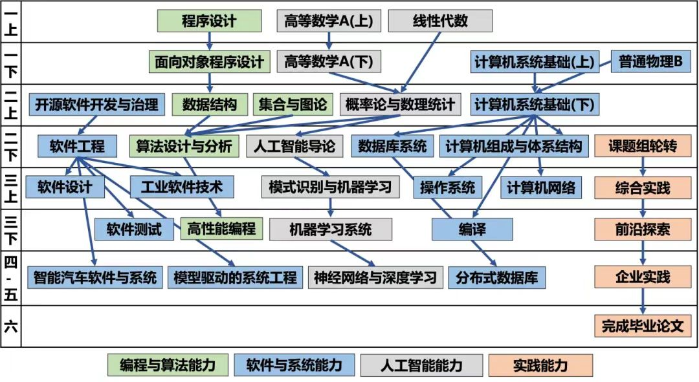
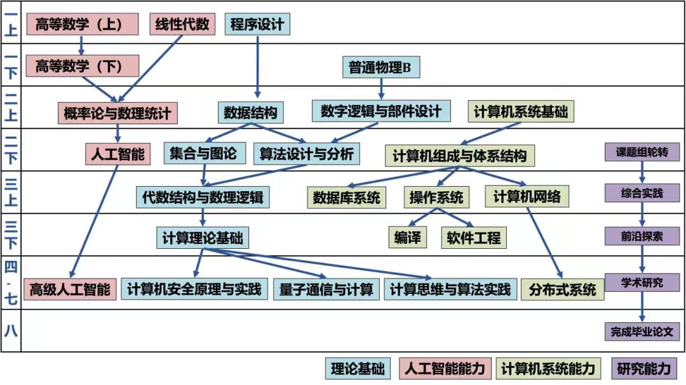

# 计算机、软件工程专业课程体系

以下课程体系依赖图来源于 [复旦大学2025年本科及本研融通教学培养方案](https://jwc.fudan.edu.cn/5e/53/c39655a745043/page.psp) 的计算机和软件工程专业部分。

2025级软件工程专业：

2025级计算机专业：

## 概念大杂烩

- **lab**: 即laboratory，指编程小作业，通常自成体系，针对某一块知识编写代码，完成某个目标。

- **pj**: 即project，指编程大作业，通常涉及内容比较广泛。

也有部分课程只有lab没有pj，则lab就是该课程的编程作业。

- **黑皮书**: 机械工业出版社出版的一系列计算机专业教材，难度较大、内容广泛，部分专业课采用该类书籍及其知识体系。

- **考研408**: 408是计算机统考考试的代码，包括数据结构、计算机网络、操作系统、计算机组成原理四门课程。

- **Markdown**: 是一种编写文档的格式，可以使用Typora等软件编写。因为方便编写、格式比较美观，所以在计算机相关专业广泛使用。本网站（freshdan）就是用markdown编写的。

例如用左右各两个星号 `*` 包围可以加粗一些文本：`**被加粗了**`  -> **被加粗了**

- **LaTeX**: 是另一种通过代码实现排版的格式，一般用于撰写规范的计算机专业论文，也可以嵌套在Markdown中插入一些公式。

例如在markdown中插入左边这个LaTeX代码会有右边的效果：`$\alpha^{\beta}$` -> $\alpha^{\beta}$

- **GitHub**: [GitHub](https://github.com/) ，是一个代码托管网站，顾名思义可以把自己的代码上传到远程服务器中，配合使用Git等工具有助于与其他开发者共同协作。除此之外，GitHub上也有许多程序员开发的许多有趣的代码项目，可以一键下载到本地。

## 部分简称对照表

| 课程简称 | 课程全名                                                  | 学期       |
| -------- | --------------------------------------------------------- | ---------- |
| 程设     | 程序设计                                                  | 大一上     |
| oop      | 面向对象程序设计（Object-Oriented Programming）           | 大一下     |
| ics      | 计算机系统基础（Introduction to Computer System）         | 大一下     |
| dcd      | 数字逻辑与部件设计（Digital Logic and Components Design） | （已删除） |
| ai       | 人工智能（Artificial Intelligence）                       | 大二下     |
| db       | 数据库设计（Database Design），db是Database的简称         | 大二下     |

除此之外，有许多工具会在知识体系中的多门课程逐渐用到（如程序设计课程可能使用Markdown撰写文档、数据结构课程可能使用Git进行版本管理、毕业论文或课题论文可能使用LaTeX撰写）。

对这些工具的系统性知识讲解可以参考 [FDUCSLG CS101](https://cs101.fducslg.com/) 。类似课程为 [MIT-Missing-Semester](https://csdiy.wiki/编程入门/MIT-Missing-Semester/) 。